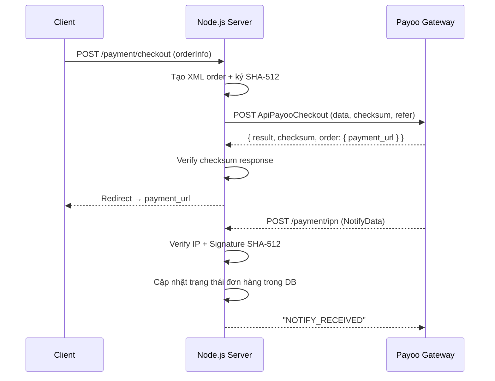

# Kế hoạch tích hợp Payoo Payment Gateway vào Node.js

> Phân tích từ mã mẫu C# (.NET) — `IntegrationSampleCode_JS_V2`

---

## 1. Tổng quan luồng thanh toán Payoo



---

## 2. Biến môi trường cần cấu hình

Tạo file `.env` với các biến sau (tham chiếu từ `Web.config`):

```env
# ---- Payoo Sandbox ----
PAYOO_CHECKOUT_URL=https://newsandbox.payoo.com.vn/v2/paynow/order/create
PAYOO_BIZ_API_URL=https://bizsandbox.payoo.com.vn/BusinessRestAPI.svc

# ---- Thông tin shop ----
PAYOO_BUSINESS_USERNAME=SB_Shop_Demo
PAYOO_SHOP_ID=11495
PAYOO_SHOP_TITLE=Shop Demo
PAYOO_SHOP_BACK_URL=http://your-domain.com/payment/return
PAYOO_SHOP_DOMAIN=http://your-domain.com
PAYOO_SHIPPING_DAYS=1
PAYOO_NOTIFY_URL=https://your-domain.com/payment/ipn

# ---- Bảo mật ----
PAYOO_CHECKSUM_KEY=ZTRkNjViNmYwYzM2NGEzZGRjM2YzMTQ1MDUyNjI5MWY=
PAYOO_API_USERNAME=SB_Shop_Demo_BizAPI
PAYOO_API_PASSWORD=5sYnd1PdsbZxgrn1
PAYOO_API_SIGNATURE=W7qx4Jy9q76BYLtOgLzqmA+wB8esHWapewZCsL/Dms1IQcGzFSLWfWe6Td9t18Ml

# ---- Payoo IPs (whitelist IPN) ----
PAYOO_IP_SANDBOX=118.69.56.194
PAYOO_IP_PRODUCTION=118.69.206.8
```

> [!CAUTION]
> **Không bao giờ** commit `ChecksumKey`, `APIPassword`, `APISignature` lên git. Dùng `.env` + `.gitignore`.

---

## 3. Cấu trúc thư mục đề xuất

```
src/
├── payment/
│   ├── payoo.config.js          # Đọc env vars
│   ├── payoo.crypto.js          # SHA-512 sign + verify
│   ├── payoo.xml.js             # Tạo XML order (tương đương PaymentXMLFactory.cs)
│   ├── payoo.api.js             # Gọi Payoo REST API (tương đương CallAPI.cs)
│   └── payoo.routes.js          # Express routes
└── app.js
```

---

## 4. Chi tiết từng module

### 4.1. `payoo.config.js` — Cấu hình

```js
// src/payment/payoo.config.js
module.exports = {
  checkoutUrl:      process.env.PAYOO_CHECKOUT_URL,
  bizApiUrl:        process.env.PAYOO_BIZ_API_URL,
  businessUsername: process.env.PAYOO_BUSINESS_USERNAME,
  shopId:           Number(process.env.PAYOO_SHOP_ID),
  shopTitle:        process.env.PAYOO_SHOP_TITLE,
  shopBackUrl:      process.env.PAYOO_SHOP_BACK_URL,
  shopDomain:       process.env.PAYOO_SHOP_DOMAIN,
  shippingDays:     Number(process.env.PAYOO_SHIPPING_DAYS),
  notifyUrl:        process.env.PAYOO_NOTIFY_URL,
  checksumKey:      process.env.PAYOO_CHECKSUM_KEY,
  apiUsername:      process.env.PAYOO_API_USERNAME,
  apiPassword:      process.env.PAYOO_API_PASSWORD,
  apiSignature:     process.env.PAYOO_API_SIGNATURE,
  allowedIPs:       [process.env.PAYOO_IP_SANDBOX, process.env.PAYOO_IP_PRODUCTION],
};
```

---

### 4.2. `payoo.crypto.js` — Ký và xác thực (tương đương `CallAPI.EncryptSHA512`)

Thuật toán: **SHA-512(checksumKey + data)**, output là chuỗi HEX **uppercase**.

```js
// src/payment/payoo.crypto.js
const crypto = require('crypto');

/**
 * SHA-512 UPPERCASE hex — tương đương EncryptSHA512() trong C#
 */
function sha512(input) {
  return crypto
    .createHash('sha512')
    .update(input, 'utf8')
    .digest('hex')
    .toUpperCase();
}

/**
 * Ký request: SHA-512(checksumKey + data)
 */
function signData(checksumKey, data) {
  return sha512(checksumKey + data);
}

/**
 * Verify checksum (case-insensitive)
 */
function verifyChecksum(checksumKey, data, signature) {
  if (!data || !signature) return false;
  return sha512(checksumKey + data).toUpperCase() === signature.toUpperCase();
}

/**
 * Verify IPN signature: SHA-512(checksumKey + responseData + payooIP)
 */
function verifyIPNSignature(checksumKey, responseData, payooIP, signature) {
  return sha512(checksumKey + responseData + payooIP).toUpperCase() === signature.toUpperCase();
}

module.exports = { sha512, signData, verifyChecksum, verifyIPNSignature };
```

---

### 4.3. `payoo.xml.js` — Tạo XML order (tương đương `PaymentXMLFactory.cs`)

```js
// src/payment/payoo.xml.js
const { encodeURIComponent } = require('querystring');

/**
 * @param {object} order
 * @param {string} order.session
 * @param {string} order.businessUsername
 * @param {number} order.shopId
 * @param {string} order.shopTitle
 * @param {string} order.shopDomain
 * @param {string} order.shopBackUrl
 * @param {string} order.orderNo
 * @param {number} order.orderCashAmount     - Đơn vị: VND
 * @param {string} order.startShippingDate   - Format: dd/MM/yyyy
 * @param {number} order.shippingDays
 * @param {string} order.orderDescription    - Nên URL-encode
 * @param {string} order.notifyUrl
 * @param {string} order.validityTime        - Format: yyyyMMddHHmmss
 * @param {string} order.customerName
 * @param {string} order.customerPhone
 * @param {string} order.customerAddress
 * @param {string} order.customerCity        - Mã tỉnh thành (vd: "60000")
 * @param {string} order.customerEmail
 */
function buildPaymentXML(order) {
  return `<shops>
    <shop>
      <session>${order.session}</session>
      <username>${order.businessUsername}</username>
      <shop_id>${order.shopId}</shop_id>
      <shop_title>${order.shopTitle}</shop_title>
      <shop_domain>${order.shopDomain}</shop_domain>
      <shop_back_url>${order.shopBackUrl}</shop_back_url>
      <order_no>${order.orderNo}</order_no>
      <order_cash_amount>${order.orderCashAmount}</order_cash_amount>
      <order_ship_date>${order.startShippingDate}</order_ship_date>
      <order_ship_days>${order.shippingDays}</order_ship_days>
      <order_description>${order.orderDescription}</order_description>
      <notify_url>${order.notifyUrl}</notify_url>
      <validity_time>${order.validityTime}</validity_time>
      <JsonResponse>true</JsonResponse>
      <customer>
        <name>${order.customerName}</name>
        <phone>${order.customerPhone}</phone>
        <address>${order.customerAddress}</address>
        <city>${order.customerCity}</city>
        <email>${order.customerEmail}</email>
      </customer>
    </shop>
  </shops>`;
}

module.exports = { buildPaymentXML };
```

---

### 4.4. `payoo.api.js` — Gọi Payoo REST API (tương đương `CallAPI.cs`)

> [!NOTE]
> Cài đặt: `npm install axios`

```js
// src/payment/payoo.api.js
const axios = require('axios');
const config = require('./payoo.config');
const { signData, verifyChecksum } = require('./payoo.crypto');

/**
 * Gọi Payoo Business REST API (getQRCode, getorderinfo, CancelOrder, ...)
 * Tương đương CallAPI.Caller() trong C#
 *
 * @param {string} apiName  - Tên endpoint (vd: "getQRCode", "CancelOrder")
 * @param {object} payload  - Request data object (sẽ được JSON.stringify)
 * @returns {object}        - Parsed response data
 */
async function callBizAPI(apiName, payload) {
  const requestData = JSON.stringify(payload);
  const signature   = signData(config.checksumKey, requestData);

  const body = {
    RequestData: requestData,
    Signature:   signature,
  };

  const response = await axios.post(
    `${config.bizApiUrl}/${apiName}`,
    body,
    {
      headers: {
        'apiusername':  config.apiUsername,
        'apipassword':  config.apiPassword,
        'apisignature': config.apiSignature,
        'content-type': 'application/json',
      },
    }
  );

  const { ResponseData, Signature: respSig } = response.data;

  if (!verifyChecksum(config.checksumKey, ResponseData, respSig)) {
    throw new Error('Invalid signature from Payoo API!');
  }

  return JSON.parse(ResponseData);
}

module.exports = { callBizAPI };
```

---

### 4.5. `payoo.routes.js` — Express Routes

> [!NOTE]
> Cài đặt: `npm install express axios`

```js
// src/payment/payoo.routes.js
const express    = require('express');
const axios      = require('axios');
const router     = express.Router();
const config     = require('./payoo.config');
const { signData, verifyChecksum, verifyIPNSignature } = require('./payoo.crypto');
const { buildPaymentXML } = require('./payoo.xml');
const { callBizAPI } = require('./payoo.api');

// ─── Helpers ────────────────────────────────────────────────────────────────

function formatDate(date) {
  // dd/MM/yyyy
  const d = String(date.getDate()).padStart(2, '0');
  const m = String(date.getMonth() + 1).padStart(2, '0');
  const y = date.getFullYear();
  return `${d}/${m}/${y}`;
}

function formatDateTime(date) {
  // yyyyMMddHHmmss
  const y  = date.getFullYear();
  const mo = String(date.getMonth() + 1).padStart(2, '0');
  const d  = String(date.getDate()).padStart(2, '0');
  const h  = String(date.getHours()).padStart(2, '0');
  const mi = String(date.getMinutes()).padStart(2, '0');
  const s  = String(date.getSeconds()).padStart(2, '0');
  return `${y}${mo}${d}${h}${mi}${s}`;
}

function getClientIP(req) {
  return (
    req.headers['x-forwarded-for']?.split(',')[0]?.trim() ||
    req.connection?.remoteAddress ||
    ''
  );
}

// ─── Route 1: Tạo đơn hàng & redirect sang Payoo ────────────────────────────
// Tương đương api_Checkout.aspx.cs → btnCheckOut_Click()

router.post('/checkout', async (req, res) => {
  try {
    const { orderNo, amount, customer } = req.body;
    // amount: số tiền VND (integer)
    // customer: { name, phone, email, address, city }

    const now      = new Date();
    const session  = orderNo || `ORD_${formatDateTime(now)}`;
    const validity = formatDateTime(new Date(now.getTime() + 24 * 60 * 60 * 1000));

    const orderData = {
      session,
      businessUsername: config.businessUsername,
      shopId:           config.shopId,
      shopTitle:        config.shopTitle,
      shopDomain:       config.shopDomain,
      shopBackUrl:      config.shopBackUrl,
      orderNo:          session,
      orderCashAmount:  amount,
      startShippingDate: formatDate(now),
      shippingDays:     config.shippingDays,
      orderDescription: encodeURIComponent(`Thanh toán đơn hàng: ${session}`),
      notifyUrl:        config.notifyUrl,
      validityTime:     validity,
      customerName:     customer.name,
      customerPhone:    customer.phone,
      customerEmail:    customer.email,
      customerAddress:  customer.address,
      customerCity:     customer.city,
    };

    const xml      = buildPaymentXML(orderData);
    const checksum = signData(config.checksumKey, xml);

    // Gọi Payoo Checkout API
    const payooRes = await axios.post(
      config.checkoutUrl,
      new URLSearchParams({
        data:          xml,
        checksum:      checksum,
        refer:         config.shopDomain,
        payment_group: '',
        bank:          '',
      }),
      { headers: { 'content-type': 'application/x-www-form-urlencoded' } }
    );

    const result = payooRes.data;
    if (result.result?.toLowerCase() !== 'success') {
      return res.status(400).json({ error: 'Payoo rejected order', detail: result });
    }

    // Verify response checksum
    const orderJson = JSON.stringify(result.order);
    if (!verifyChecksum(config.checksumKey, orderJson, result.checksum)) {
      return res.status(400).json({ error: 'Invalid response checksum' });
    }

    // Trả về payment_url để client redirect
    return res.json({ payment_url: result.order.payment_url });

  } catch (err) {
    console.error('[Payoo Checkout Error]', err.message);
    return res.status(500).json({ error: err.message });
  }
});

// ─── Route 2: IPN Listener (Payoo callback sau khi user thanh toán) ──────────
// Tương đương IPN_Listenner.aspx.cs → Page_Load()

router.post('/ipn', express.text({ type: '*/*' }), async (req, res) => {
  try {
    const payooIP = getClientIP(req);

    // Whitelist IP
    if (!config.allowedIPs.includes(payooIP)) {
      console.warn(`[Payoo IPN] Rejected IP: ${payooIP}`);
      return res.status(403).send('Forbidden');
    }

    const notifyData = req.body?.NotifyData || new URLSearchParams(req.body).get('NotifyData');
    if (!notifyData) {
      return res.status(400).send('Missing NotifyData');
    }

    // Decode Base64
    const decoded = Buffer.from(notifyData, 'base64').toString('utf8');
    const pkg     = JSON.parse(decoded); // { ResponseData, Signature }

    // Verify: SHA-512(checksumKey + ResponseData + payooIP)
    if (!verifyIPNSignature(config.checksumKey, pkg.ResponseData, payooIP, pkg.Signature)) {
      console.error('[Payoo IPN] Invalid signature');
      return res.send('Verified checksum is failure!');
    }

    const invoice = JSON.parse(pkg.ResponseData);
    // invoice.PaymentStatus === 1 → thanh toán thành công

    if (invoice.PaymentStatus === 1) {
      // TODO: Cập nhật DB — đánh dấu đơn hàng invoice.OrderNo là đã thanh toán
      console.log(`[Payoo IPN] Order ${invoice.OrderNo} paid successfully`);
    }

    return res.send('NOTIFY_RECEIVED');

  } catch (err) {
    console.error('[Payoo IPN Error]', err.message);
    return res.status(500).send('Internal Server Error');
  }
});

// ─── Route 3: Lấy QR Code ───────────────────────────────────────────────────
// Tương đương api_GetQRCode.aspx.cs → GetQRCode()

router.post('/qrcode', async (req, res) => {
  try {
    const { orderNo, amount, notifyUrl, description } = req.body;
    const now    = new Date();
    const expire = new Date(now.getTime() + 24 * 60 * 60 * 1000);

    const payload = {
      UserName:          config.businessUsername,
      ShopID:            config.shopId,
      OrderNo:           orderNo || `ORD_${formatDateTime(now)}`,
      CyberCash:         amount,
      FromShipDate:      formatDate(now),
      ShipNumDay:        1,
      Description:       encodeURIComponent(description || `Đơn hàng ${orderNo}`),
      PaymentExpireDate: formatDateTime(expire),
      NotifyUrl:         notifyUrl || config.notifyUrl,
    };

    const data = await callBizAPI('getQRCode', payload);

    if (data.ResponseCode !== '0') {
      return res.status(400).json({ error: 'QR code generation failed', code: data.ResponseCode });
    }

    return res.json({
      qrCode:     data.QRCode,
      qrCodeLink: data.QRCodeLink,
      expireAt:   expire.toISOString(),
    });

  } catch (err) {
    console.error('[Payoo QRCode Error]', err.message);
    return res.status(500).json({ error: err.message });
  }
});

// ─── Route 4: Lấy thông tin đơn hàng ────────────────────────────────────────
// Tương đương api_GetOrderInformation.aspx.cs

router.get('/order/:orderId', async (req, res) => {
  try {
    const payload = {
      OrderId: req.params.orderId,
      ShopId:  String(config.shopId),
    };

    const data = await callBizAPI('getorderinfo', payload);
    return res.json(data);

  } catch (err) {
    console.error('[Payoo GetOrder Error]', err.message);
    return res.status(500).json({ error: err.message });
  }
});

// ─── Route 5: Huỷ đơn hàng ──────────────────────────────────────────────────
// Tương đương api_CancelOrder.aspx.cs

router.post('/order/:orderId/cancel', async (req, res) => {
  try {
    const payload = {
      ShopID:    String(config.shopId),
      OrderID:   req.params.orderId,
      NewStatus: '3', // 3 = cancelled
      UpdateLog: req.body.reason || 'Cancelled by merchant.',
    };

    const data = await callBizAPI('CancelOrder', payload);
    return res.json({ success: true, data });

  } catch (err) {
    console.error('[Payoo CancelOrder Error]', err.message);
    return res.status(500).json({ error: err.message });
  }
});

module.exports = router;
```

---

### 4.6. Đăng ký routes vào `app.js`

```js
// app.js
require('dotenv').config();
const express       = require('express');
const payooRoutes   = require('./src/payment/payoo.routes');

const app = express();
app.use(express.json());
app.use(express.urlencoded({ extended: true }));

app.use('/payment', payooRoutes);

app.listen(3000, () => console.log('Server running on port 3000'));
```

---

## 5. Tóm tắt API endpoints

| Method | Endpoint | Mô tả |
|--------|----------|-------|
| `POST` | `/payment/checkout` | Tạo đơn và nhận `payment_url` |
| `POST` | `/payment/ipn` | Nhận callback từ Payoo sau thanh toán |
| `POST` | `/payment/qrcode` | Tạo QR code thanh toán |
| `GET`  | `/payment/order/:orderId` | Lấy thông tin đơn hàng |
| `POST` | `/payment/order/:orderId/cancel` | Huỷ đơn hàng |

---

## 6. Bảng so sánh C# → Node.js

| C# (Gốc) | Node.js (Chuyển đổi) |
|---|---|
| `EncryptSHA512(key + data)` | `crypto.createHash('sha512').update(...).digest('hex').toUpperCase()` |
| `PaymentXMLFactory.GetPaymentXML()` | `buildPaymentXML()` trong `payoo.xml.js` |
| `CallAPI.Caller(apiName, data)` | `callBizAPI(apiName, payload)` trong `payoo.api.js` |
| `Request.Form["NotifyData"]` | `req.body.NotifyData` (Express) |
| `Convert.FromBase64String()` | `Buffer.from(str, 'base64')` |
| `ConfigurationManager.AppSettings[]` | `process.env.*` + `dotenv` |
| IP Whitelist (`HTTP_X_FORWARDED_FOR`) | `req.headers['x-forwarded-for']` |

---

## 7. Checklist tích hợp

- [ ] Cài dependencies: `npm install axios dotenv`
- [ ] Tạo file `.env` với đầy đủ biến môi trường (mục 2)
- [ ] Thêm `.env` vào `.gitignore`
- [ ] Tạo 5 file trong `src/payment/` theo mục 4
- [ ] Đăng ký routes trong `app.js` (mục 4.6)
- [ ] Test checkout flow với Payoo Sandbox
- [ ] Test IPN bằng ngrok (expose localhost để Payoo gọi về)
- [ ] Implement DB update trong IPN handler (đánh dấu đơn đã thanh toán)
- [ ] Đổi URL sang Production khi go-live

---

## 8. Lưu ý quan trọng

> [!WARNING]
> **IPN IP Whitelist**: Sandbox IP là `118.69.56.194`, Production là `118.69.206.8`. Chỉ chấp nhận callback từ 2 IP này, bỏ qua mọi request khác.

> [!IMPORTANT]
> **Checksum luôn uppercase**: SHA-512 phải cho ra chuỗi hex **UPPERCASE** (`.toUpperCase()`), nếu không verify sẽ fail.

> [!NOTE]
> **IPN Signature khác Checkout Signature**: IPN signature = `SHA-512(checksumKey + ResponseData + payooIP)` — có thêm IP ở cuối.

> [!TIP]
> **Test IPN local**: Dùng `ngrok http 3000` → lấy HTTPS URL làm `PAYOO_NOTIFY_URL` trong `.env`.
